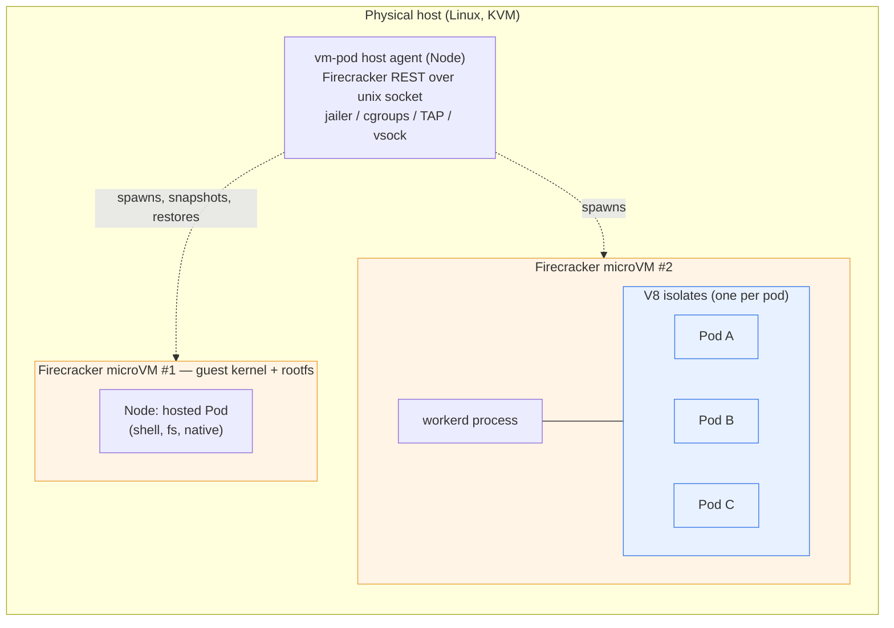
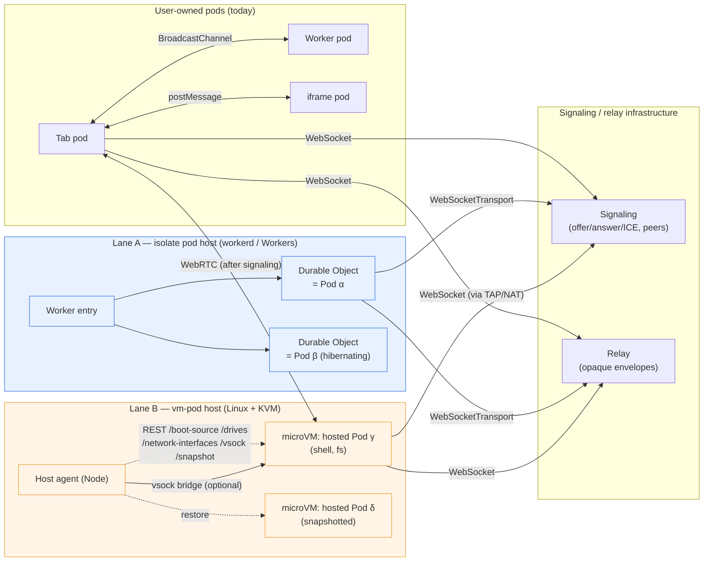
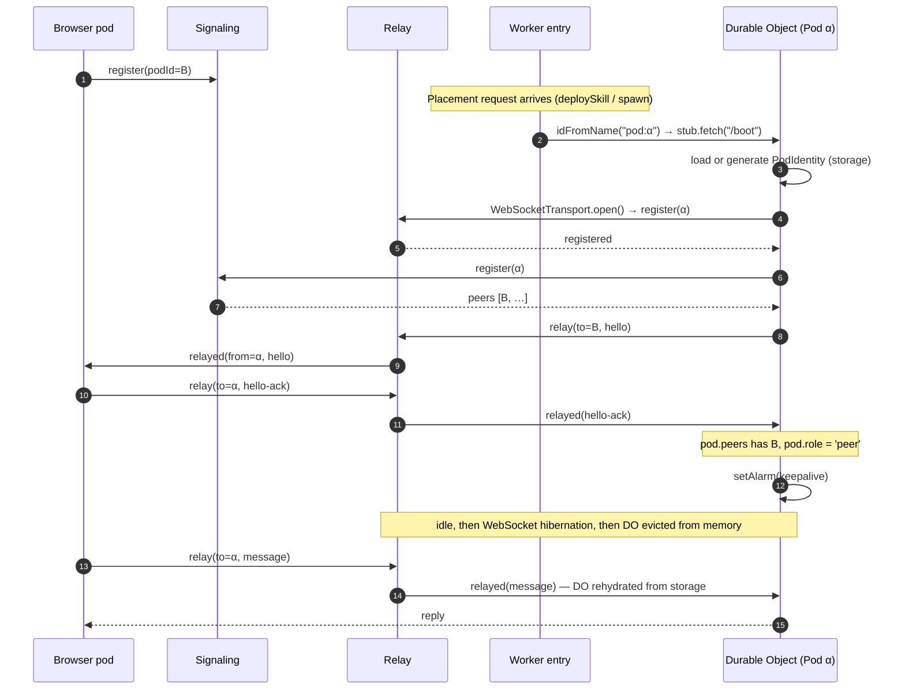
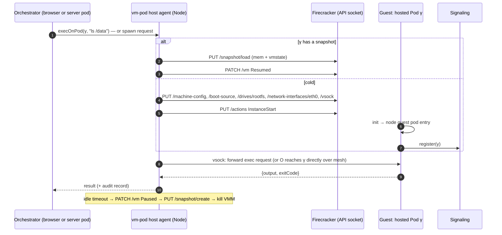
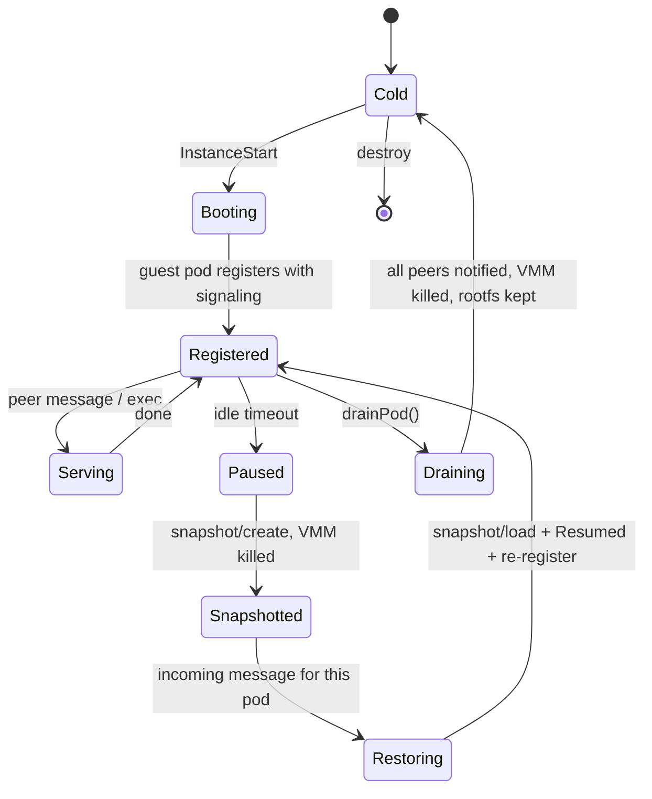
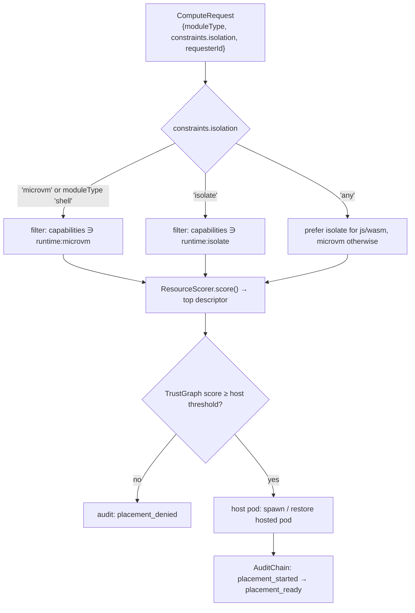

# Hosted pods: running `Pod` outside the browser

## Status

This document tracks [issue #185](https://github.com/johnhenry/browsermesh/issues/185)
and is maintained as a living design doc, not a point-in-time proposal — update it
as the work packages land rather than filing a new doc. Five work packages were
spun out of the issue, each on its own branch:

| WP | Scope | Branch |
| --- | --- | --- |
| WP1 | `WebSocketTransport` adapter for `@johnhenry/browsermesh-pod` | `agent/wp1-ws-transport` |
| WP2 | Isolate pod host spike (`workerd` / Durable Objects) | `agent/wp2-isolate-host` |
| WP3 | microVM pod host spike (Firecracker) | `agent/wp3-vm-host` |
| WP4 | Placement: `ComputeRequest.constraints.isolation`, scorer rules, `execOnPod` guard | `agent/wp4-placement` |
| WP5 | This doc, pod README runtime-requirements section, `node:vm` warning, TransportAdapter conformance suite | `agent/wp5-docs` |

See [§8](#8-work-packages) for per-package detail and checkboxes.

## Motivation

`Pod` (`@johnhenry/browsermesh-pod`) is defined as "any execution context," but
every context the stack supports today is one the *user* owns: a tab, an
iframe, a worker, or a Node process they started themselves. **Hosted pods**
are pods that run on a machine someone else operates, in one of two isolation
lanes, with the orchestrator choosing the lane per job:

| Lane | Technology | Good for | Boundary | Spawn | Footprint |
| --- | --- | --- | --- | --- | --- |
| **A: isolate pod** | V8 isolate (workerd / Cloudflare Workers + Durable Objects) | JavaScript skills, agents, CRDT replicas, relays | Language-level (V8) | ~ms | ~MBs |
| **B: microVM pod** | Firecracker microVM running a `Pod` subclass | `execOnPod` shell commands, native binaries, filesystem services | Hardware (KVM) | ~100s of ms | ~10s of MB |

These are **not** two ways of doing the same thing. They are different layers
(Cloudflare runs isolates; Lambda, Fly and Vercel Sandbox run Firecracker)
that happen to solve adjacent problems. Five things motivate this design:

1. **Pods have a placement dimension the codebase hasn't named yet.** Where a
   pod runs, and what the host promises, is a real axis that the current
   `role` model (`autonomous`/`child`/`peer`) doesn't capture.
2. **The sandbox moves with the pod.** The browser tab is what makes browser
   P2P safe today. A hosted pod needs a replacement boundary before the
   marketplace, quotas, payments and audit chain in `browsermesh-apps` mean
   anything on a host someone else controls.
3. **Two lanes, chosen per job.** Isolates for JS; microVMs for shell/native.
   `browsermesh-apps`' `ResourceScorer` already has a `runtime:<class>`
   capability notion (`packages/browsermesh-apps/src/resources.mjs`) and the
   orchestrator already knows about a `shellBackend` field
   (`packages/browsermesh-apps/src/orchestrator.mjs`) — this design wires
   those existing hooks to real runtimes rather than inventing new ones.
4. **One missing adapter unlocks the cheap lane.** A `WebSocketTransport` for
   `@johnhenry/browsermesh-pod` (WP1) is what stands between today's code and
   a pod running inside a Worker.
5. **Durable Object ≈ pod.** Stable identity, storage, alarms, hibernating
   WebSockets. Sleeping pods that wake on a message is a primitive neither
   browser tabs nor a plain server process can offer today.

## 1. Runtime requirements of `Pod`

This section was re-verified against this branch's checkout of `main`
(`packages/browsermesh-pod/src/*.mjs`, `packages/browsermesh-primitives/src/identity.mjs`)
rather than carried over from the issue text. Several of the issue's original
claims were off in ways worth recording, since the whole point of hosting a
`Pod` outside the browser is getting this list exactly right.

### What a default `pod.boot()` actually touches

`packages/browsermesh-pod/src/pod.mjs` is runtime-agnostic: it imports only
`PodIdentity` from `@johnhenry/browsermesh-primitives` plus its own sibling
modules (`detect-kind.mjs`, `capabilities.mjs`, `messages.mjs`,
`transport.mjs`, `discovery.mjs`). Nothing in `pod.mjs` itself touches
`window`/`document`/`navigator`. Walking an actual `new Pod().boot()` call
with the default (no `opts.transport`/`opts.discovery`) path in a server-like
environment (no `window`, no `document`) touches, in order:

| Requirement | Where | Confirmed how |
| --- | --- | --- |
| `crypto.subtle` — Ed25519 `generateKey` | `PodIdentity.generate()`, `browsermesh-primitives/src/identity.mjs:129` | Always runs unless `opts.identity` is supplied |
| `crypto.subtle` — `exportKey('raw')` + SHA-256 `digest` | `derivePodId()`, `identity.mjs:93-94` | Always runs, inside `PodIdentity.generate()` |
| `btoa` / `atob` | `encodeBase64url()` / `decodeBase64url()`, `identity.mjs:7-26` | Always runs — `derivePodId()` calls `encodeBase64url()` on every boot. **Not called out in the original issue text**, but it's a real dependency: an isolate or guest missing global `btoa`/`atob` breaks identity the same way missing WebCrypto Ed25519 does. Node ≥16, browsers, and `workerd` all provide these as globals, so it isn't a blocker — just an omission worth recording. |
| `setTimeout` | `TransportDiscovery.start()`, `discovery.mjs:105` | Runs whenever a non-`NullDiscovery` adapter is used — i.e. whenever `opts.transport` is anything but absent/Null, including in Node |
| `setTimeout` | `Pod.#parentHandshake()`, `pod.mjs:292` | Only runs when `detectPodKind()` returns `'iframe'` or `'spawned'` — never fires server-side, since those kinds require `window` |

Two corrections to the issue's original bullet list follow directly from this:

- **`setTimeout` is not "one call."** There are two call sites. The one in
  `discovery.mjs` is the one that actually matters for a hosted pod — it runs
  on every boot that uses a real transport (including `EventEmitterTransport`
  in Node), not just the browser-only parent-handshake path in `pod.mjs`.
- **`crypto.subtle` is exercised more broadly than "generateKey, sign, verify,
  exportKey('raw')."** `identity.mjs` has six call sites across `generateKey`
  (×2 — one inside the optional `probeEd25519Support()` capability probe,
  one inside `PodIdentity.generate()`), `exportKey('raw')`, `digest('SHA-256')`,
  `sign('Ed25519')`, and the static `verify('Ed25519')`. A default
  `pod.boot()` exercises exactly three of them — `generateKey`, `exportKey`,
  `digest` — since `sign`/`verify` are only invoked when application code
  explicitly signs or verifies something, not during boot itself.

Two more corrections remove requirements the issue listed that are **not**
actually exercised by this package today:

- **`TextEncoder`/`TextDecoder` are not used anywhere in
  `packages/browsermesh-pod/src/`.** They appear exactly twice in the whole
  monorepo-relevant surface, both in `browsermesh-primitives/src/wire.mjs`
  (`encodeMeshMessage`/`decodeMeshMessage`), which `Pod` does not import.
  `Pod`'s own messages (`messages.mjs`) are plain JS objects passed straight
  to the transport — no text encoding happens in the `Pod` boot/messaging
  path. This requirement may matter for packages that *do* use the wire
  format (`browsermesh-transport`, `browsermesh-netway`), but it is not a
  `Pod` requirement as the issue stated.
- **`structuredClone` is not used anywhere in `packages/browsermesh-pod/src/`
  either.** Its only appearance in the two packages this doc covers is in
  `browsermesh-primitives/src/test-transport.mjs` (`DeterministicRNG`/
  `TestMesh`'s `LocalChannel`), which is a *test-only* deterministic-transport
  helper re-exported from primitives' `index.mjs` for other packages' test
  suites — unrelated to `Pod`'s own boot or identity path. Like
  `TextEncoder`/`TextDecoder`, this was likely inherited from thinking about
  `browsermesh-primitives`' general surface rather than `Pod`'s actual code.

One precision fix to the issue's "browser globals used per file" table:
`postMessage` is not confined to `transport.mjs`. `BroadcastChannelTransport`
calls `this.#channel.postMessage(msg)` (the `BroadcastChannel` instance's own
method), but `pod.mjs` itself also calls `target.postMessage(hello, '*')`
directly in `#parentHandshake()`, where `target` is `g.parent` or `g.opener`.
That call is gated behind `detectPodKind()` returning `'iframe'`/`'spawned'`,
so it is inert in any context without `window` — but it means the "browser
globals" table should list `pod.mjs` itself as a (conditional) `postMessage`
user, not just the transport adapter.

Re-verified correct, as stated in the issue:

| File | Browser-only globals used |
| --- | --- |
| `transport.mjs` | `BroadcastChannel` (and a `BroadcastChannel` instance's own `postMessage`) |
| `discovery.mjs` | none directly — protocol-level only, built on whatever transport it's given |
| `injected-pod.mjs` | `window`, `document`, `postMessage` (via an injected `extensionBridge`) |
| `capabilities.mjs` | `navigator`, `indexedDB`, `fetch`, `WebAssembly`, `RTCPeerConnection`, `SharedArrayBuffer`, plus `MessageChannel`, `SharedWorker`, `WebSocket`, `WebTransport`, `caches`, `OffscreenCanvas` (all feature-detected, never required) |
| `detect-kind.mjs` | `window`, `document`, `*WorkerGlobalScope` |

The constructor takes `opts.transport` (any object with `send`/`onMessage`/
`open`/`close`/`ready`) and `opts.discovery` (any `DiscoveryAdapter`).
`detectPodKind()` returns `'server'` whenever there is no `window`/`document`
and no worker global scope (`detect-kind.mjs`, confirmed), so a pod in a
microVM guest running Node, a `node:vm` context, or a `worker_threads`
worker reports `'server'` without code changes. **Inside workerd the answer
is `'service-worker'`**, because workerd's global satisfies `instanceof
ServiceWorkerGlobalScope`, which is checked first (measured in WP2). Hosted-pod
logic must therefore treat both kinds as "not a browser window" and never
branch on `'server'` alone. See the
[`node:vm` warning](#node-vm-and-worker_threads-are-not-a-security-boundary)
below for why that is not the same thing as a security boundary.

### What `browsermesh-pod` does not yet have

**A transport that leaves the process.** `BroadcastChannelTransport` is
same-origin tabs; `EventEmitterTransport` is in-process only. Nothing in
`browsermesh-pod` can speak to a relay or signaling server over the network.
This is what WP1's `WebSocketTransport` is for (see [§4](#4-lane-a--isolate-pods)).

**Where `browsermesh-servers` lives.** The relay (port 8788), signaling
(port 8787) and `ServerPod` (`kernel/server-pod.mjs`, a `Pod` subclass on
`EventEmitterTransport` + `NullDiscovery` in Node) referenced throughout this
doc are **not in this monorepo**. They are the sibling repo
[johnhenry/browsermesh-servers](https://github.com/johnhenry/browsermesh-servers),
which consumes the published `@johnhenry/browsermesh-pod` and
`@johnhenry/browsermesh-primitives` packages. WP1's tests and example 12 use
an in-process fake of its relay/signaling protocol so this repo stays
self-contained; WP2's end-to-end harness clones the real servers.

## 2. The two technologies, side by side

A microVM is a **hardware** boundary: its own guest kernel, memory mapped by
KVM, devices limited to what the VMM emulates (virtio-net, virtio-block,
vsock, balloon, entropy, pmem). An isolate is a **language** boundary: one V8
heap inside a shared process, no OS access unless the embedder hands it a
binding. They nest naturally (isolates inside a microVM is exactly what
Cloudflare does at the edge) but do not substitute for each other.

| | V8 isolate (workerd / Workers) | Firecracker microVM |
| --- | --- | --- |
| Host OS | Linux, macOS (workerd binary), Windows | **Linux + `/dev/kvm` only.** Nothing runs on macOS |
| What runs inside | JavaScript / Wasm with the Web platform (WebCrypto incl. Ed25519, WebSocket, timers, `structuredClone`) | A full Linux userland: Node, shells, binaries |
| What *cannot* run inside | Shell, native modules, WebRTC (`RTCPeerConnection`), `BroadcastChannel` | Nothing in principle; GPU passthrough is not supported; no shared-filesystem device (virtio-fs) |
| Boundary strength | Strong for JS; weak against V8 zero-days and timing side channels. Mitigations: no `SharedArrayBuffer`, coarse timers, process-per-trust-domain | Hardware virtualisation; jailer adds seccomp + cgroups + chroot. The industry baseline for running strangers' code |
| Spawn | ~1–5 ms | ~125 ms boot; snapshot restore ≪ boot |
| Memory per pod | ~1–5 MB | ~5 MB VMM overhead + guest RAM (tens of MB for Node) |
| Pods per host | thousands | tens to hundreds |
| Persistence primitive | Durable Object storage, alarms, WebSocket hibernation | Snapshot/restore to disk; block device |
| Self-hostable | Yes (`workerd`) | Yes (needs a KVM host); hosted via Fly Machines, Vercel Sandbox, E2B |
| Fits which existing hook | `deploySkill`, agent/CRDT-replica, relay roles | `execOnPod`, terminal/filesystem services, `shellBackend` |

Why **not** the other "isolate-ish" options:

- **`isolated-vm`** (Node native addon): bare V8. You shim WebCrypto, timers
  and the message bridge yourself; upstream is in maintenance mode (Node 26
  needs its 7.x line); its own README says to run isolates in a separate
  process from anything critical — which is most of what workerd already
  does for us.
- **`node:vm` / `worker_threads`: not a security boundary.** Fine for packing
  many *trusted* pods into one process; useless for strangers' code. See the
  callout box below.
- **gVisor / Kata**: valid, heavier than Firecracker for the same threat
  model, and no better fit for the existing hooks. Out of scope.

### `node:vm` and `worker_threads` are not a security boundary

> **This gets its own heading because it is the single most likely footgun
> in this design.** `node:vm`'s own Node.js docs say so explicitly, and
> `worker_threads` share the process's memory space and OS permissions.
> Neither isolates untrusted code from the host process or from other code
> running in the same process. They are useful for packing many pods you
> *already trust* into one process to save memory — never for running a
> stranger's code. If a placement decision needs to run code from an
> untrusted `requesterId`, it goes to Lane A (V8 isolate) or Lane B
> (Firecracker microVM), not `node:vm`.

## 3. Target topology

**No new servers.** Both lanes are designed to join the mesh through signaling
and relay infrastructure using the existing `register`/`relay`/`relayed`
protocol shape described in the issue — see the caveat in
[§1](#what-browsermesh-pod-does-not-yet-have) about that infrastructure's
exact location. Isolate pods *must* go through a relay (no WebRTC inside an
isolate); microVM pods *may* do WebRTC through the host's NAT like any Node
peer.

Key properties:

- **Identity is per pod, not per host.** Each hosted pod has its own
  `PodIdentity`. In Lane A the keypair lives in Durable Object storage
  (non-extractable `CryptoKey` is not persistable; store the raw seed,
  encrypted at rest with the DO's own key, or accept extractable keys for the
  spike). In Lane B the keypair lives in the guest's block device. In both
  lanes the *host operator* can read the key — see [§7](#7-identity-trust-and-what-hosting-cannot-promise).
- **The host is itself a pod.** The vm-pod host agent and the Worker entry
  each run a plain `Pod`-style identity that advertises
  `runtimeClasses: ['microvm']` / `['isolate']` to the orchestrator and
  accepts placement requests. Hosted pods are *children* of that host pod in
  the existing `role` model (`autonomous`/`child`/`peer`).

## 4. Lane A — isolate pods

### 4.1 What is missing (exactly one thing, plus plumbing)

**`WebSocketTransport` for `@johnhenry/browsermesh-pod`** (WP1). A
`TransportAdapter` that:

- Connects to a URL (relay or signaling server), sends
  `{type:'register', podId}` on open, and waits for `registered`.
- `send(msg)` wraps the Pod message as `{type:'relay', to: <target|'*'>,
  envelope: msg}`. Broadcast (`'*'`) is needed for `TransportDiscovery`'s
  `hello`/`ack`/`goodbye`; a plain relay forwards point-to-point only, so the
  adapter needs either (a) a `channel`/room concept added server-side, or (b)
  discovery seeded from a `peers` list and `hello` sent point-to-point to
  each. **(b) requires no server change and is the spike path.**
- `onMessage(handler)` unwraps `relayed` envelopes.
- Takes an injectable `WebSocket` constructor (same pattern as
  `BroadcastChannelTransport`'s injectable `BCConstructor` — see
  `packages/browsermesh-pod/src/transport.mjs`), so it is testable with a
  fake and works in Node 26 (global `WebSocket`), browsers, and workerd.
- Reconnects with backoff; surfaces `ready`.
- Zero dependencies, matching the package's existing posture.

### 4.2 Durable Object as pod

| Pod concern | Durable Object feature |
| --- | --- |
| Stable identity | `idFromName(podId)`; keypair seed in `ctx.storage` |
| CRDT / KV state | `ctx.storage` (KV or SQLite-backed) |
| Keepalive / announce interval | `ctx.storage.setAlarm()` |
| Cheap idle | WebSocket Hibernation API — the pod costs nothing between messages |
| Single-threaded message ordering | DO's one-at-a-time execution model |

Self-hosted path: `workerd` with a `config.capnp` that declares the Worker
and the DO namespace; no Cloudflare account needed for the spike. `cf dev`
(Cloudflare's Wrangler successor, open beta — the spike migrated off
Wrangler 4 to it) is the quickest local harness. See WP2.

### 4.3 Threat model for Lane A

An isolate pod protects the *host* from the *pod's JavaScript* and pods from
each other, within V8's guarantees. It does **not** protect against V8
exploits or Spectre-class leaks between isolates in one process.
Accordingly:

- Pods from *different trust domains* (different `requesterId` in a compute
  request) should go in different workerd processes, or the host should only
  accept isolate placements from peers above a trust threshold.
- `SharedArrayBuffer` and high-resolution timers must stay off (workerd
  default).
- Everything a pod can reach is through the `TransportAdapter` and whatever
  bindings the embedder exposes — i.e. the `browsermesh-kernel` tenant
  capability model, enforced *outside* the isolate, is the right gate (see
  the mapping table in [§6](#6-placement-orchestrator-and-resource-changes)).

## 5. Lane B — microVM pods

### 5.1 Firecracker facts that shape the design

- Linux + KVM, x86_64 and aarch64. **No macOS.** Develop on a Linux box, a
  KVM-capable VPS, or hosted Firecracker (Fly Machines, Vercel Sandbox, E2B).
  Apple Silicon nested virtualisation (macOS 15+, M3+) can host a Linux VM
  that runs Firecracker, but that is a dev convenience, not a target.
- Control plane is a REST API over a Unix socket: `PUT /boot-source`,
  `PUT /drives/{id}`, `PUT /network-interfaces/{id}`, `PUT /vsock`,
  `PUT /machine-config`, `PUT /actions {InstanceStart}`,
  `PUT /snapshot/create`, `PUT /snapshot/load`, `PATCH /vm {Paused|Resumed}`.
- Devices: virtio-net (TAP on host), virtio-block, vsock, balloon, entropy,
  pmem. Rate limiters on net and block are built in and map directly onto
  quota enforcement.
- `jailer` wraps the VMM in chroot + seccomp + cgroups + a dedicated uid.
  Always use it for strangers' code.
- No virtio-fs. Guest storage is a block image; host↔guest file transfer
  goes over vsock or the network.
- No GPU passthrough. `browsermesh-apps`' GPU path stays browser-side or
  bare metal.

### 5.2 Host agent design

Components (all intended for a new, separately deployable `vm-pod-host/`
location outside this monorepo's published packages, per the issue's
original plan — not created by WP5):

- `firecracker-client.mjs` — tiny HTTP-over-unix-socket client for the API
  above. Pure Node (`http.request` with `socketPath`). Fully testable on
  macOS against a fake socket server.
- `vm-pod.mjs` — lifecycle state machine (§5.3), with jailer invocation, TAP
  setup commands (emitted, not executed, in dry-run mode), vsock bridge.
- `host-pod.mjs` — a `Pod` subclass that advertises
  `runtimeClasses: ['microvm']`, `shellBackend: 'vm-console'` and accepts
  placement.
- `guest/` — `init` script and rootfs build script (Alpine or Debian slim +
  Node 26). Produces `rootfs.ext4` and expects a stock `vmlinux` from the
  Firecracker CI artifacts.
- `DRY_RUN=1` mode so everything but the actual `firecracker` binary runs in
  CI and on macOS.

### 5.3 Lifecycle

The same diagram applies to Lane A with `Paused`/`Snapshotted` replaced by DO
hibernation and eviction — which is the point: **the orchestrator sees one
lifecycle, two implementations.**

## 6. Placement: orchestrator and resource changes

Existing hooks on `main` this plugs into (file locations verified against
this checkout, which differ slightly from the issue's original references —
both `orchestrator.mjs` and `mesh-orchestrator.mjs` exist under
`packages/browsermesh-apps/src/`, along with `resources.mjs`):

- `ResourceScorer` (`packages/browsermesh-apps/src/resources.mjs`) already
  has a scoring notion for `capabilities.includes('runtime:' + …)`.
- `packages/browsermesh-apps/src/orchestrator.mjs` already derives compute
  descriptors from runtime peer metadata.
- `execOnPod()`/`deploySkill()`/`drainPod()` already exist as gated
  orchestrator actions (`packages/browsermesh-apps/src/mesh-orchestrator.mjs`,
  `mesh-orchestrator-tools.mjs`).
- A compute request's `moduleType` is `'wasm' | 'js'` today.

Proposed additions (WP4):

1. **`ComputeRequest.constraints.isolation: 'isolate' | 'microvm' | 'any'`**
   (default `'any'`). Scorer: hard-zero a descriptor that lacks the
   requested lane; prefer `isolate` for `moduleType: 'js'|'wasm'` when
   `'any'`; a request with `entry` that is a shell command (new
   `moduleType: 'shell'`) requires `microvm`.
2. **Canonical runtime classes**: `isolate`, `microvm`, `browser`, `node`.
   Documented in `browsermesh-apps`' README and emitted by both host pods.
3. **`execOnPod` guard**: if the resolved runtime is `isolate`, return
   `{exitCode: 126, output: 'pod runtime "isolate" cannot execute shell
   commands; use deploySkill or a microvm pod'}` and write an audit record,
   instead of today's silent `exitCode 1` generic failure.
4. **Kernel capability → lane limit mapping** (documented, enforced by the
   host, not by the orchestrator). `KERNEL_CAP` values are defined in
   `packages/browsermesh-kernel/src/constants.mjs`:

| `KERNEL_CAP` | Isolate pod | microVM pod |
| --- | --- | --- |
| `NET` | may open `WebSocketTransport`; outbound `fetch` allowlist in Worker bindings | TAP with host NAT + nftables allowlist; Firecracker net rate limiter |
| `FS` | none (no fs) | rootfs read-only + writable `/data` block device; Firecracker block rate limiter |
| `CLOCK` | DO alarms | guest clock; vsock heartbeats |
| `IPC` | DO-to-DO via stubs | vsock to host agent only |
| `STDIO` | `console` → host log sink | serial console → host log sink |
| `MESH` | relay/signaling registration permitted | same, plus WebRTC via host NAT |
| `ENV` | Worker `vars` | kernel cmdline / `/etc/environment` |
| `PAYMENT`, `CONSENSUS` | unchanged (mesh-level) | unchanged |
| memory / CPU | workerd isolate limits | `machine-config` `vcpu_count`/`mem_size_mib` + jailer cgroups |

## 7. Identity, trust, and what hosting cannot promise

- **The host can always read a hosted pod's key.** Isolate memory is
  readable by the embedder; guest memory is readable by the VMM owner.
  Attestation (SEV-SNP / TDX) is out of scope. Consequence: a hosted pod's
  signatures prove "this pod *or its host*." Trust records should carry a
  `hostedBy: <hostPodId>` relationship so trust decisions can account for it.
- **Revocation does not claw back decrypted data** — the same "honest
  limitation" the root README already states for `CloudStorage`. Hosting
  makes this more visible, not different.
- **Hosted pods are `child`-role pods of the host pod** in the existing
  `autonomous`/`child`/`peer` model. `drainPod()` on the host must cascade.
- **Placement is a mesh action and must be audited**, the same way
  `execOnPod`/`deploySkill` already are (`remote_deploy_*` records). New
  record types: `placement_requested`, `placement_denied`,
  `placement_started`, `placement_ready`, `placement_evicted`.

## 8. Lifecycle

See [§5.3](#53-lifecycle) for the state diagram, which is shared between
lanes (`Paused`/`Snapshotted` in Lane B map to DO hibernation/eviction in
Lane A). The orchestrator-facing contract is one lifecycle regardless of
lane: `cold → booting → registered → idle → (paused/hibernated) →
(restored) → registered → draining → cold`.

## 9. Work packages

Each is independently mergeable; WP1 is the critical path for WP2 and the
WebSocket example.

- [ ] **WP1 — `WebSocketTransport` adapter in `@johnhenry/browsermesh-pod`**
  (`agent/wp1-ws-transport`). New `src/ws-transport.mjs`, exported from
  `src/index.mjs`, typed in `index.d.ts`. Must pass the TransportAdapter
  conformance suite this WP (WP5) introduces — see
  [§10](#10-transportadapter-conformance-suite).
- [ ] **WP2 — Isolate pod host spike** (`agent/wp2-isolate-host`,
  `spikes/isolate-pod-host/`). `cloudflare.config.ts` (migrated from
  `wrangler.toml` to Cloudflare's `cf` CLI, open beta) + Worker + Durable
  Object pod, keypair persisted in DO storage, keepalive via alarm,
  WebSocket hibernation, a `workerd`-based test harness.
- [ ] **WP3 — microVM pod host spike** (`agent/wp3-vm-host`,
  `vm-pod-host/` or `spikes/vm-pod-host/`). `firecracker-client.mjs` tested
  against a fake unix-socket server, `vm-pod.mjs` lifecycle state machine
  with `DRY_RUN`, `host-pod.mjs`, guest rootfs/init scripts.
- [ ] **WP4 — Placement in `browsermesh-apps`** (`agent/wp4-placement`).
  `ComputeRequest.constraints.isolation`, `moduleType: 'shell'`, canonical
  runtime classes, scorer rules, `execOnPod` isolate guard, placement audit
  record types, `hostedBy` in descriptors.
- [x] **WP5 — Design doc, pod README, `node:vm` warning, adapter conformance
  suite** (`agent/wp5-docs`, this change). `docs/hosted-pods.md` (this file);
  `packages/browsermesh-pod/README.md`'s "Running a Pod outside the browser"
  section; the `node:vm`/`worker_threads` warning; `detectPodKind`'s
  isolate/microVM behavior documented;
  `packages/browsermesh-pod/test/helpers/transport-conformance.mjs` plus
  `packages/browsermesh-pod/test/transport-conformance.test.mjs` wired for
  `EventEmitterTransport`, `BroadcastChannelTransport`, and `NullTransport`;
  `examples/README.md` pointer.

## 10. TransportAdapter conformance suite

`packages/browsermesh-pod/test/helpers/transport-conformance.mjs` exports
`runTransportConformance(name, makeTransport, { makePair, delivers })`, a
shared `node:test` suite that any `TransportAdapter` must pass:

- `ready` is `false` before `open()` and `true` after.
- `onMessage`'s handler receives messages a *peer* transport sends, never
  the handler's own `send()` calls.
- `send()` before `open()` is a no-op — it must not throw.
- `close()` sets `ready` back to `false` and stops delivery.
- Double `open()`/`close()` are idempotent.
- A message object round-trips structurally equal end to end.
- A handler that throws does not break delivery to *other* receivers on the
  same bus.

It currently runs against `EventEmitterTransport` (a shared bus via
`EventEmitterTransport.createBus()`), `BroadcastChannelTransport` (with an
in-process fake `BroadcastChannel` constructor, following the same
`StubBroadcastChannel` pattern already used in
`packages/browsermesh-pod/test/transport.test.mjs`), and `NullTransport`
(registered with `delivers: false`, which relaxes the peer-delivery
assertions to "never delivers anything, and that's correct" instead of
skipping the suite outright).

**Adding `WebSocketTransport` (WP1, on a sibling branch) is a one-line
registration** in `packages/browsermesh-pod/test/transport-conformance.test.mjs`
— see the comment at the top of that file.

## 11. Measurements that decide whether this continues

| Measure | Lane A target | Lane B target | Why it matters |
| --- | --- | --- | --- |
| Spawn → `registered` on signaling | < 100 ms | < 1 s (cold), < 300 ms (restore) | Whether pods can be created per job |
| Memory per idle pod | < 5 MB | < 40 MB | How many hosted pods one node can offer |
| Wake on message after idle | < 50 ms (hibernation) | < 300 ms (snapshot) | Whether "sleeping pods" is a usable primitive |
| Message RTT browser ↔ hosted pod via relay | < 2× browser ↔ browser via relay | same | Relay is the only path for isolates |

### Measured so far

Lane A, WP2 (`spikes/isolate-pod-host`, `cf dev` on a laptop — migrated from
`wrangler dev`, open beta — relay and signaling on loopback):

| Measure | Measured | Note |
| --- | --- | --- |
| Spawn → `registered` | ~26–42 ms | Relay + signaling handshake only |
| `Pod.boot()` wall time | ~1.5 s | Dominated by `TransportDiscovery`'s fixed discovery window, not connection cost; a hosted pod should use a shorter `discoveryTimeout` |
| Wake on message after idle | ≈ cold boot (~1.5 s) | **WebSocket Hibernation does not apply**: it only covers sockets a Durable Object *accepts* as a server. `PodObject` dials *out* to the relay, and an open outbound socket pins the DO in memory. Getting hibernation back requires inverting the topology so peers (or the relay) dial the DO. Tracked as open question 6 |
| Message RTT via relay | 1–2 ms | Loopback |
| Memory per idle pod | not measured | workerd does not expose per-isolate memory under local `cf dev` |
| `cf dev` cold start | ~4 s (range ~4–13 s) | Beta rough edge: slower and more variable than `wrangler dev`'s ~1.0–1.1 s, because `cf dev` delegates to a cold `npx vite` on top of miniflare/workerd init. See `spikes/isolate-pod-host/README.md`'s "Migrated from wrangler to cf" note. |

Lane B, WP3 (`spikes/vm-pod-host`): built on macOS against a fake Firecracker
API. Since then the spike's `FirecrackerClient` has been run against a real
Firecracker v1.16.1 on an x86_64 KVM host with a stock CI kernel and a
busybox initramfs (not the Alpine + Node guest, no jailer, no network):

| Measure | Measured | Note |
| --- | --- | --- |
| `start()` → guest `/init` running | ~585 ms | Guest reports 0.35 s uptime; this is kernel boot only, not a `registered` pod |
| Snapshot create (Full, 128 MiB) | ~460 ms | |
| `loadSnapshot` + resume | 8 ms | API call; guest resumed ticking immediately |
| Firecracker RSS, idle after restore | ~19 MB | Memory is file-backed and lazily faulted |

The `registered` figures need the real guest image and root on a KVM host
(jailer, TAP, rootfs build). See the spike's README for what the run exposed
in `VmPod.restore()`.

These numbers are targets for WP2/WP3's spikes to measure, not yet-measured
results — this table should gain a second column with real numbers once
those spikes report.

## 12. Open questions

1. Should the relay grow a `channel` concept so discovery broadcasts don't
   need a signaling-server `peers` list? (Server-side change outside this
   monorepo as checked out; defer until WP1 shows the fan-out cost.)
2. Where should the hosted pod's keypair seed live in Lane A — extractable
   key in DO storage (simple, host-readable anyway) or derived from a
   DO-held secret? Spike with extractable.
3. Does `Pod.role` need a fourth value (`hosted`) or is `child`-of-host
   sufficient? (Current `PodRole` typedef in `pod.mjs` already allows
   `'controlled'`/`'hybrid'` beyond the three documented values — worth
   checking whether one of those already covers this before adding a fifth.)
4. Should `ComputeRequest` carry a *budget* (credits via a payment channel)
   that the host pod must accept before placement? Probably yes, but after
   the spikes.
5. Multiple data channels over one WebRTC connection (issue #115) would let
   a microVM pod multiplex several hosted services over one peer link;
   related, not blocking.
6. Should the isolate topology be inverted so the relay (or peers) dial the
   Durable Object rather than the DO dialing out? That is the only way to
   get WebSocket Hibernation, and therefore cheap idle pods, in Lane A (WP2
   finding). It would need the relay to act as a WebSocket client toward
   registered hosted pods.

## Non-goals

Attestation; GPU in either lane; a general container runtime; replacing any
existing server-side kernel package (it becomes the *guest* in Lane B);
changes to the wire format in `browsermesh-primitives`.

## References

- Firecracker: https://github.com/firecracker-microvm/firecracker (API,
  jailer, snapshotting, network setup docs)
- workerd: https://github.com/cloudflare/workerd ; Durable Objects +
  WebSocket Hibernation docs
- isolated-vm (maintenance mode): https://github.com/laverdet/isolated-vm
- This repo: `packages/browsermesh-pod/src/{pod,transport,discovery,detect-kind,capabilities,messages}.mjs`,
  `packages/browsermesh-primitives/src/identity.mjs`,
  `packages/browsermesh-apps/src/{orchestrator,mesh-orchestrator,resources}.mjs`,
  `packages/browsermesh-kernel/src/constants.mjs`
- Issue: [johnhenry/browsermesh#185](https://github.com/johnhenry/browsermesh/issues/185)
